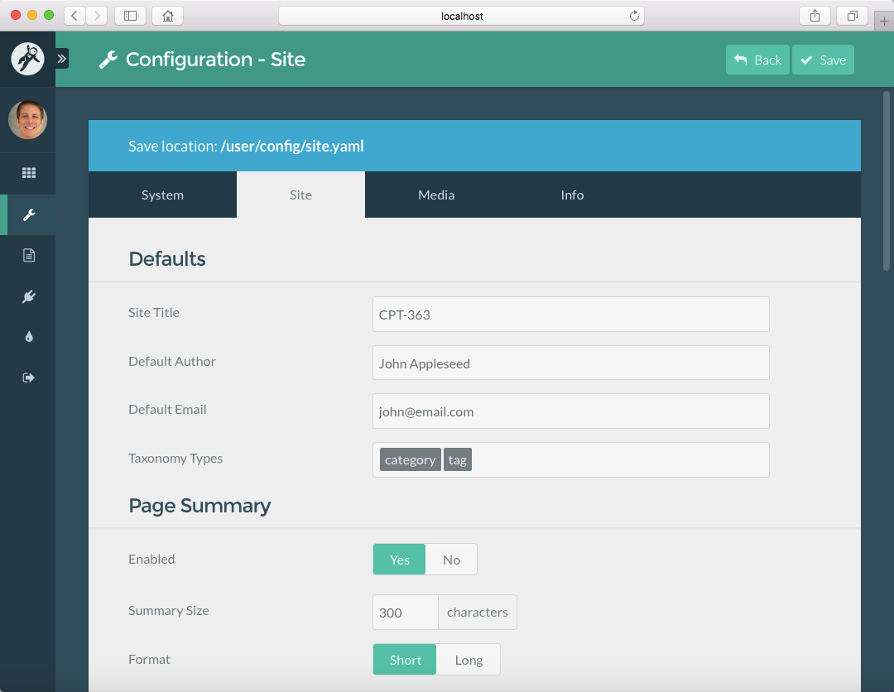
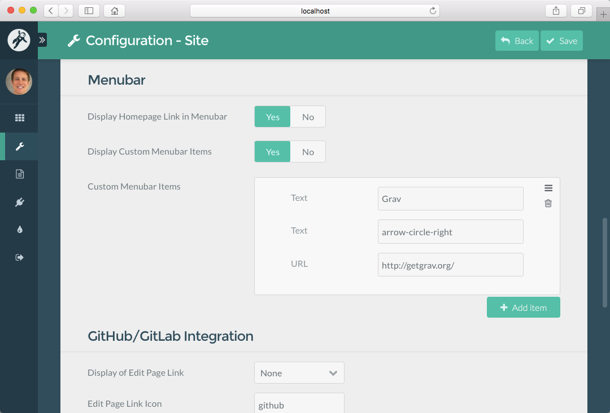
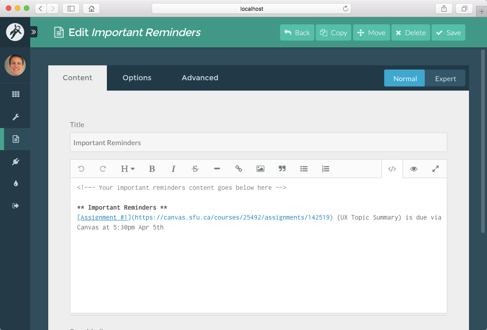
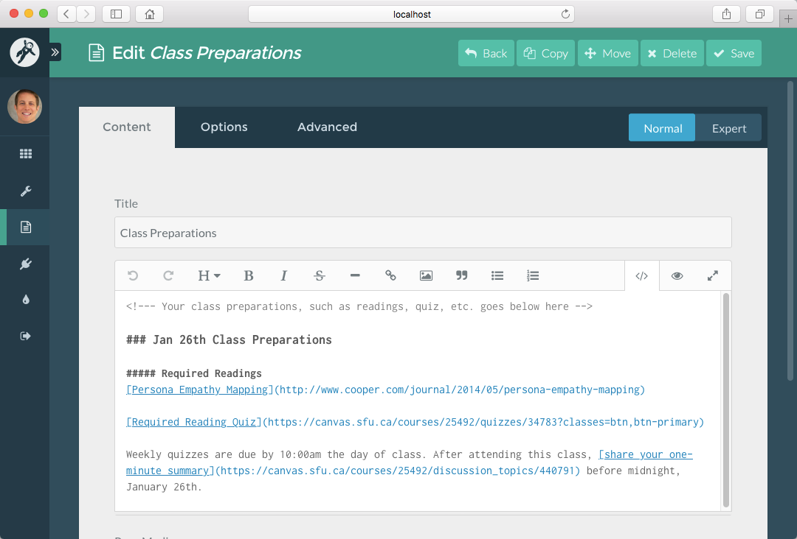
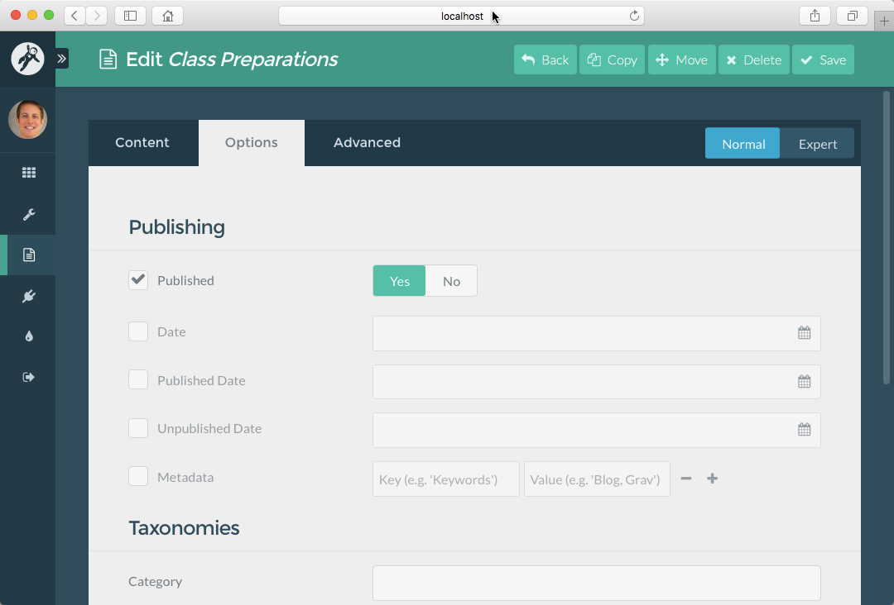
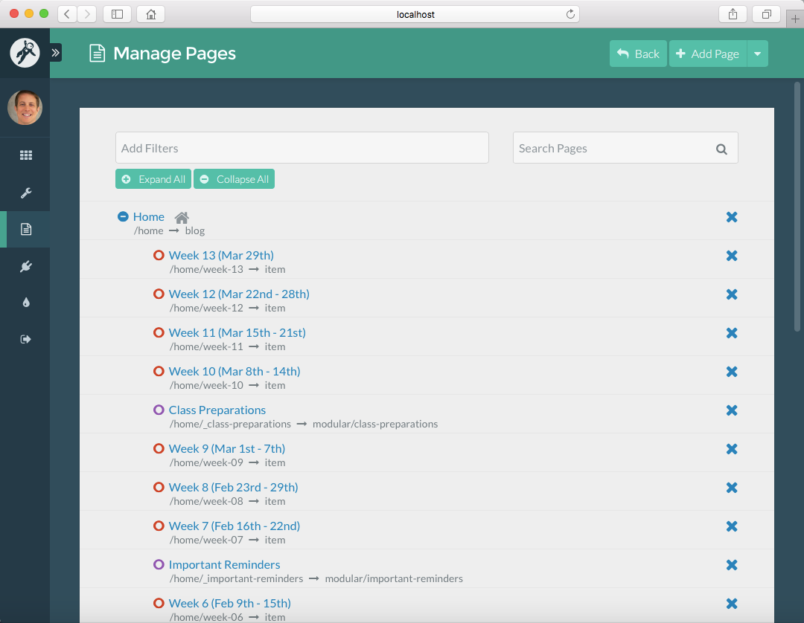
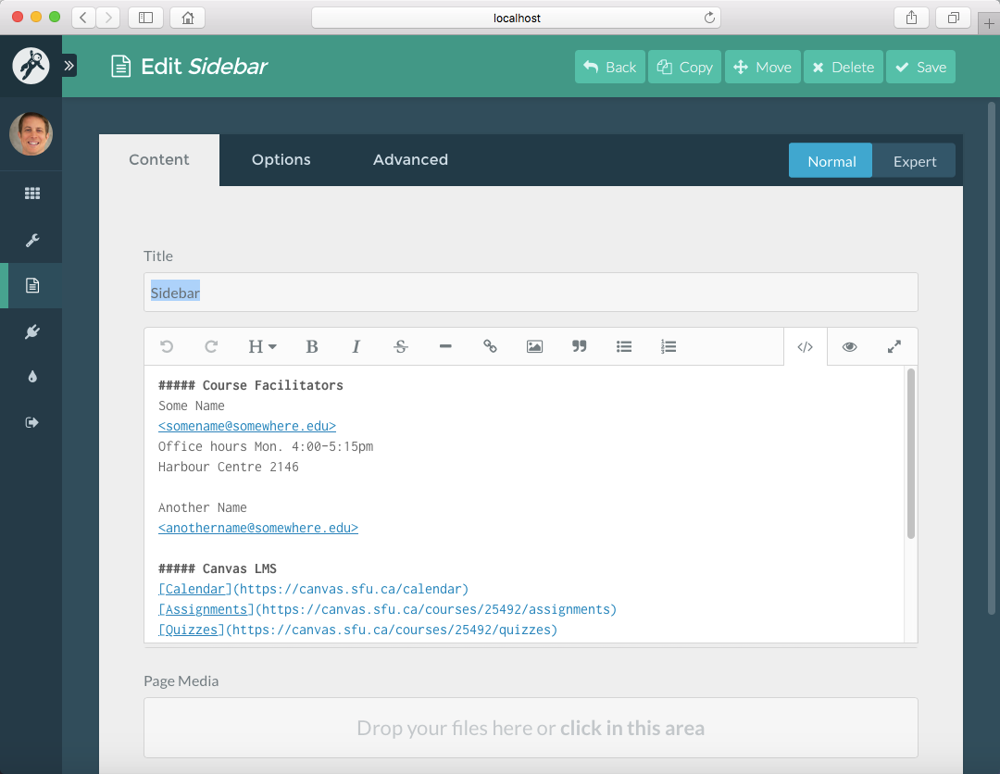
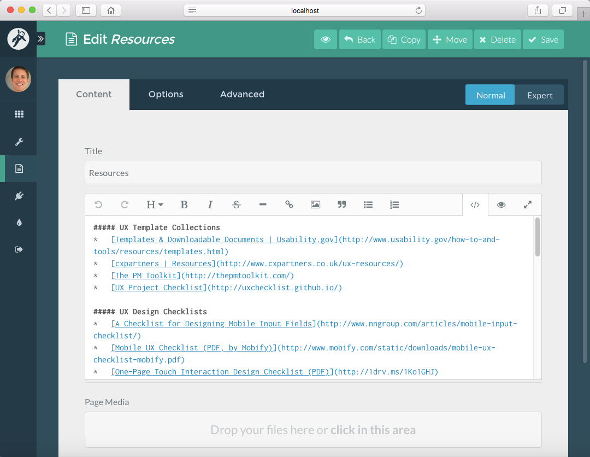
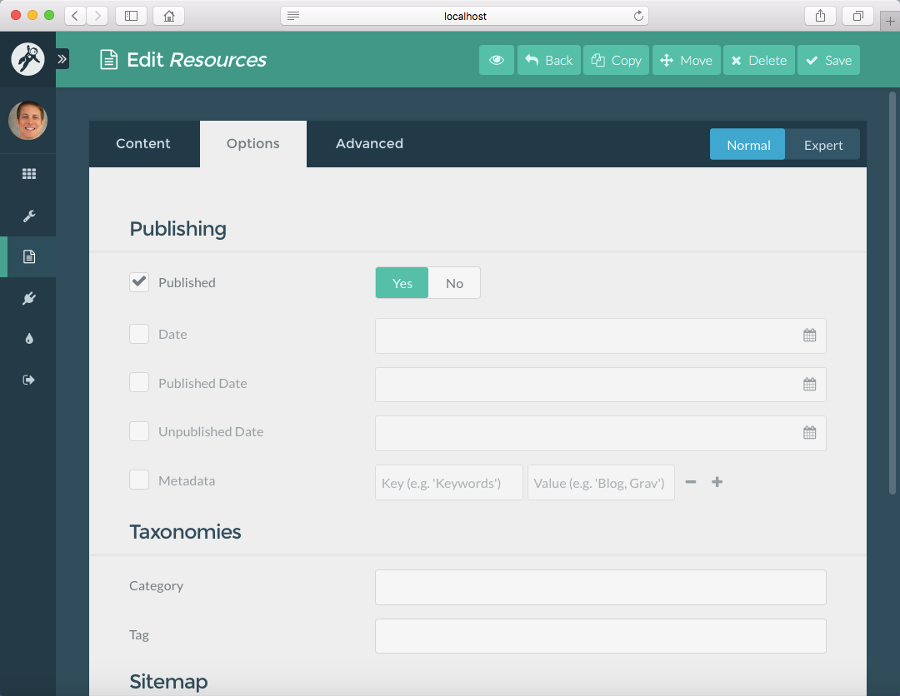
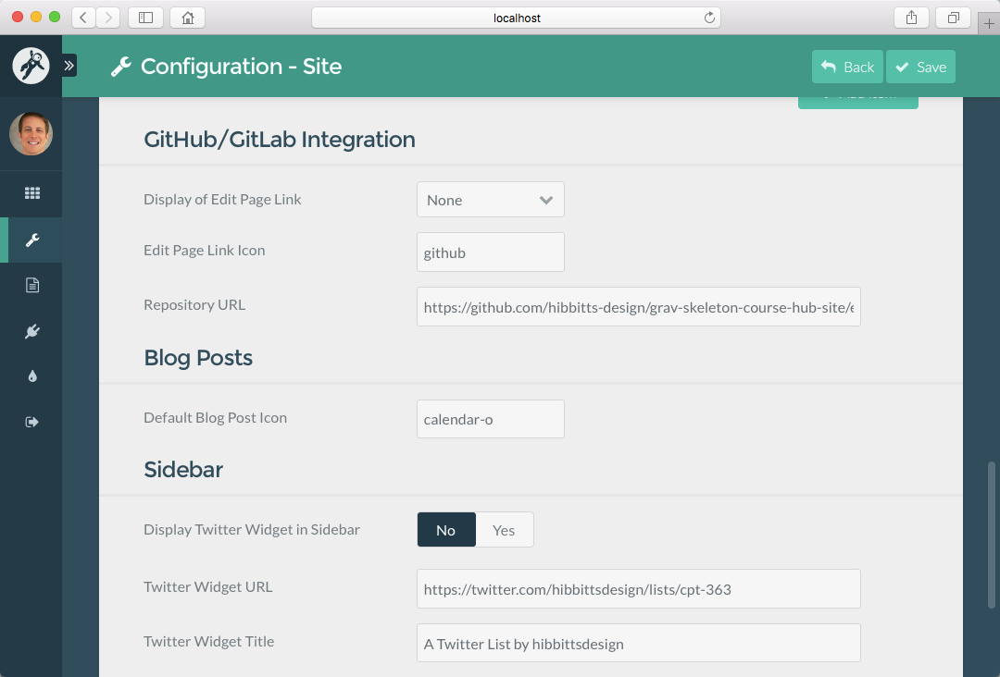

This is a guide on how to setup your Grav Course Hub for a single course using the Admin Panel (accessed by adding ‘/admin’ to the Browser URL of your Grav site) or directly working with files. This guide assumes you have the [Grav Course Hub up and running](../2016-02-12-grav-course-hub-getting-started-guide) and that you are familiar with the [basics of Grav](https://learn.getgrav.org/basics/basic-tutorial).

===

!! This guide is now outdated. View the updated [Setting up a Course](http://learn.hibbittsdesign.org/coursehub/setting-up-a-course) documentation on the new [learn.hibbittsdesign.org](http://learn.hibbittsdesign.org) site.

**Table of Contents**  
[Overview of How the Course Hub is Organized](#overview-of-how-the-course-hub-is-organized)  
[Setting the Name of Your Course Hub](#setting-the-name-of-your-course-hub)  
[Setting the Header Image for Your Course Hub](#setting-the-header-image-for-your-course-hub)  
[Adding Custom Menubar Items to Your Course Hub](#adding-custom-menubar-items-to-your-course-hub)  
[Editing Important Reminders on Your Course Hub Homepage](#editing-important-reminders-on-your-course-hub-homepage)  
[Editing Class Preparations on Your Course Hub Homepage](#editing-class-preparations-on-your-course-hub-homepage)  
[Adding Class/Topic summaries to Your Course Hub Homepage](#adding-classtopic-summaries-to-your-course-hub-homepage)  
[Customizing Your Course Hub Sidebar](#customizing-your-course-hub-sidebar)  
[Adding Pages to Your Course Hub](#adding-pages-to-your-course-hub)  
[Editing Pages in Your Course Hub](#editing-pages-in-your-course-hub)   
[Enabling GitHub/GitLab Collaboration in Your Course Hub](#enabling-githubgitlab-collaboration-in-your-course-hub)  
[All Course Hub Site Configuration Options](#all-site-configuration-options)  
[All Course Hub Page Header Options](#all-page-header-options)

### Overview of How the Course Hub is Organized
A Course Hub containing a single course ([multiple courses](../2016-06-15-including-multiple-courses-within-a-hub) are also supported) has a blog-style Homepage, with entries for weekly summaries or topics, and one or more pages. Pages are ordered in the menubar by their numeric prefixes (i.e. ```01.Home``` is the first item in the menubar).   
  
_Figure 1. Course Hub `pages` folder structure._

Each page in the Course Hub consists of a folder which contains a Markdown file, which determines how the page is rendered (i.e. which template is used to display the file). Page folders may also contain one or more images to be displayed on a page.
  
_Figure 2. Example Course Hub ```page``` folder (including Markdown file)._

### Setting the Name of Your Course Hub
#### Admin Panel (Course Hub Skeleton v1.4+)
  
_Figure 3. Course Hub **Site Title**  field on **Configuration - Site** Admin Panel page._  

#### Working with Files
  
_Figure 4. Course Hub `title` field in ```site.yaml``` file (located in ```/user/config/``` folder)._  

### Setting the Header Image for Your Course Hub
If an image (regardless of its filename) is placed within the ```/pages/headerimage``` folder it will be used as the header image for every page within the Course Hub. To have no image displayed as a header image simply remove the default image file provided.

  
_Figure 5. Course Hub header image file (located in ```/pages/headerimage``` folder)._

### Adding Custom Menubar Items to Your Course Hub
#### Admin Panel (Course Hub Skeleton v1.4+)
  
_Figure 6. Course Hub **Menubar** items on **Configuration - Site** Admin Panel page._  

#### Working with Files
To include custom menubar items set the ```displaymenuentries``` field to ```true```. To have no custom menubar items displayed set the ```displaymenuentries``` field to ```false```

  
_Figure 7. Course Hub ```displaymenuentries``` toggle field in ```site.yaml``` file (located in ```/user/config/``` folder)._   

To define one or more custom menubar items include a ```text``` and/or ```icon``` value along with the ```url``` value for each defined ```menu``` list.
  
_Figure 8. Course Hub ```menu``` items in ```site.yaml``` file (located in ```/user/config/``` folder)._  

### Editing Important Reminders on Your Course Hub Homepage
#### Admin Panel (Course Hub Skeleton v1.4+)
To change the content of the Important Reminders area on the Course Hub homepage edit the page 'Important Reminders', located under the page 'Home'.
  
_Figure 9. Course Hub **Important Reminders** Admin Panel page._  

To not display the Important Reminders area on the Course Hub homepage, set the 'Published' option of that page to 'No'.
  
_Figure 10. Course Hub **Important Reminders** page **Published** option in the Admin Panel._

#### Working with Files
To not display the Important Reminders area on the Homepage, set the 'published' field to false.    
<i> Figure 11. Course Hub ```important-reminders.md``` Markdown file (located in ```/01.home/_important-reminders/``` folder).</i>  

### Editing Class Preparations on Your Course Hub Homepage
#### Admin Panel (Course Hub Skeleton v1.4+)
To change the content of the Class Preparations area on the Course Hub homepage edit the page 'Class Preparations', located under the page 'Home'.

To not display the Class Preparations area on the Course Hub homepage, set the 'Published' option of the page to 'No'.

  
_Figure 12. Course Hub **Class Preparations** page in Admin Panel._  

  
_Figure 13. Course Hub **Class Preparations** page **Published** option in the Admin Panel._

#### Working with Files
To not display the Class Preparations area on the Homepage, set the 'published' field to false.  
  
<i> Figure 14. Course Hub ```important-preparations.md``` Markdown file (located in ```/01.home/_class-preparations/``` folder).</i>  

### Adding Class/Topic summaries to Your Course Hub Homepage
#### Admin Panel (Course Hub Skeleton v1.4+)
To add a class/topic summary to your Course Hub Homepage when working with the Admin Panel, tap the ```Add Page``` button, then in the resulting dialog box (see below) name the page, set the ```Parent Page``` to ```Home``` and use the Template ```Item```.
  
_Figure 15. Course Hub HomePage items in the Admin Panel._  

  
_Figure 16. Adding a new Course Hub HomePage item within the ```Home``` parent folder and using the ```item``` template._  

#### Working with Files
To add a class/topic summary to your Course Hub Homepage when working with files directly, copy an existing item and then edit both the name of the page folder and the Markdown file contained within it. Do not change the name of the Markdown file unless you want to change the Grav Template used to render it.
  
_Figure 17. Course Hub HomePage items folder._

### Customizing Your Course Hub Sidebar
#### Admin Panel (Course Hub Skeleton v1.4+)
  
_Figure 18. Course Hub **Sidebar** page in Admin Panel_

#### Working with Files
  
_Figure 19. Course Hub sidebar folder (located in ```/pages/sidebar``` folder)._

  
_Figure 20. Course Hub ```sidebar.md``` Markdown file (located in ```/pages/sidebar``` folder)._

### Adding Pages to Your Course Hub
#### Admin Panel (Course Hub Skeleton v1.4+)
To add a page to your Course Hub when working with the Admin Panel, tap the ```Add Page``` button, then in the resulting dialog box (see below) name the page, set the ```Parent Page``` to ```Root``` and use the Template ```Sidebarpage``` or ```Fullwidthpage```.
  
_Figure 21. Adding a new Course Hub page using the ```sidebarpage``` template in the Admin Panel._  

#### Working with Files
To add a page to your Course Hub Homepage when working with files directly, copy an existing page and then edit both the name of the page folder and the Markdown file contained within it. Use the filename ```sidebarpage.md``` for a page with a sidebar, or ```fullwidthpage.md``` for a page without a sidebar.
  
_Figure 22. Course Hub resources page with sidebar ```sidebarpage.md``` Markdown file (located in ```/02.resources/``` folder._

  
_Figure 23. Course Hub syllabus page with no sidebar ```fullwidthpage.md``` Markdown file (located in ```/03.syllabus/``` folder._

### Editing Pages in Your Course Hub
#### Admin Panel (Course Hub Skeleton v1.4+)
  
_Figure 24. Course Hub **Resources** page in the Admin Panel._

  
_Figure 25. Course Hub **Resources** page options in the Admin Panel._

  
_Figure 26. Course Hub **Resources** page header in the Admin Panel (```Expert View```)._

#### Working with Files
  
_Figure 27. Course Hub resources page ```sidebarpage.md``` Markdown file (located in ```/02.resources/``` folder)._

### Enabling GitHub/GitLab Collaboration in Your Course Hub]
#### Admin Panel (Course Hub Skeleton v1.4+)
  
_Figure 28. Course Hub **GitHub/GitLab Integration** items on **Configuration - Site** Admin Panel page._

#### Working with Files
To enable GitHub (or GitLab or any other Web-based Git service) set the ```GitHub:Enabled``` field to either ```page``` or ```menu```, set the ```GitHub:icon``` field to the relevant [Font Awesome](http://fontawesome.io/icons/) icon and then finally set the ```Github:url``` field to the URL of your Git repository (this usually includes the ```pages``` folder).
  
_Figure 29. Course Hub `github` settings in ```site.yaml``` file (located in ```/user/config/``` folder)._  

#### Using GitHub and GitHub Desktop
* [Introduction to GitHub](https://github.github.com/on-demand/intro-to-github/)
* [Getting Started with GitHub Desktop](https://help.github.com/desktop/guides/getting-started/)  

### All Site Configuration Options  
```
title: CPT-363
metadata:
    description: 'A short description of your course would go here'
displaymenuentries:
    enabled: true         # display of additional menu entries
menu:                     # menu entry for adding external sites/tools
    - text: Grav
      icon: arrow-circle-right
      url: http://getgrav.org/
icon:                     # default Font Awesome icons for preparation and post entries
    post: calendar-o
github:
    location: none        # menu | page | none
    icon: github
    tree: https://github.com/hibbitts-design/grav-skeleton-course-hub-site/edit/master/user/pages/
twittertimeline:
    enabled: false        # display of Twitter timeline on sidebar
    url: https://twitter.com/hibbittsdesign/lists/cpt-363
    text: A Twitter List by hibbittsdesign
    height: 700
hidehomemenulink: false   # suppress Home menu link
```
_Figure 30. All Course Hub site configuration options  in ```site.yaml``` file (located in ```/user/config/``` folder)._  

### All Page Header Options  
```
icon: users           # optional Font Awesome icon for page title
header_image: false   # display of header image located within page folder
continue_link: false  # display entire post on blog listing page
taxonomy:
  tag: Featured       # setting to make post 'sticky' (i.e. remain at top)
```
_Figure 31. All optional Course Hub page header options for Homepage items._  

```
hidegithublink: true  # hide GitHub edit link for this page
githublink: https://github.com/hibbitts-design/grav-skeleton-course-hub/tree/master/pages/01.home   # to override the automatically calculated GitHub URL
hidepagetitle: true  # hide the display of the title of this page
```
_Figure 32. All optional Course Hub page header options for pages._  

<br>
Suggestion or corrections to this guide? [<i class="fa fa-github" aria-hidden="true"></i> Edit this Page on GitHub](https://github.com/hibbitts-design/hibbitts-design-org-blog/edit/master/posts/2016-07-18-setting-up-your-grav-course-hub/post.md)
<br>
