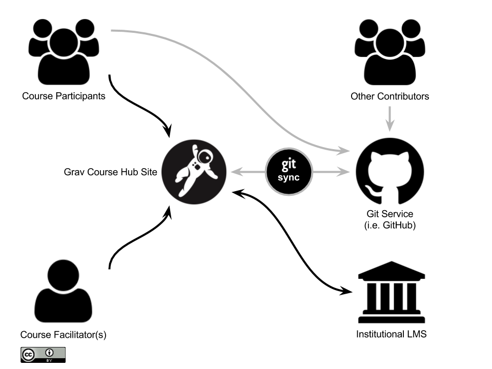

_I recently [tweeted the key problems Grav Open Course Hub was created to solve](https://twitter.com/hibbittsdesign/status/890281333011824640) for tech-savvy educators, and I thought I would share them here:_

1. Pedagogical goals are unmet by the current Learning Platform (e.g. LMS or CMS) alone
2. Student and facilitator experiences, especially multi-device, are below expectations
3. Ability to access, share and collaboratively edit course materials are too limited
4. The creation, updating and reuse of online course materials is too time consuming
5. Once created, online course materials are difficult to reuse/update on different platforms for different contexts
6. Unable to fully apply existing Web authoring skills in current Learning Platform

With the Open Course Hub intentionally designed to work with your existing Learning Platform (by 'flipping' it, as shown below using an LMS in the example). This means that instructors can immediately try to address the above problems while still using their existing Learning Platform to store sensitive student data and other course requirements.

  
_Figure 1. Flipped LMS approach using Grav Open Course Hub with Git Sync_

So, do these challenges resonate with you? How are you currently solving them? I'd love to hear from you!
